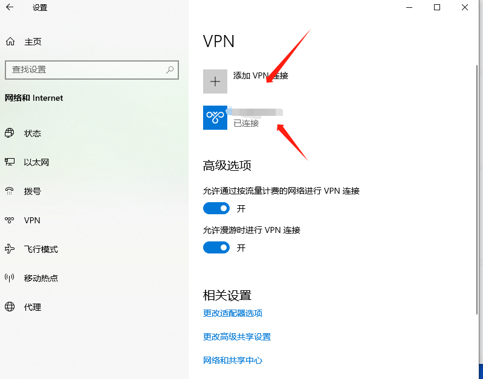
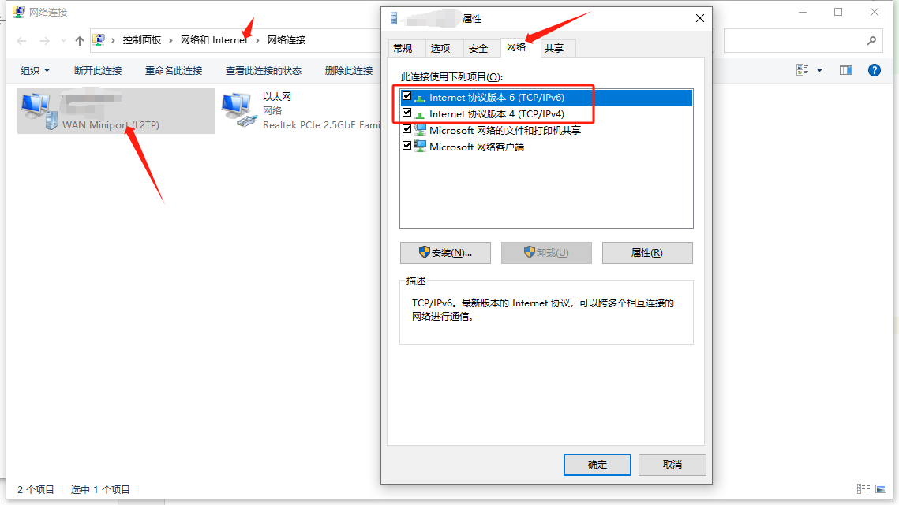
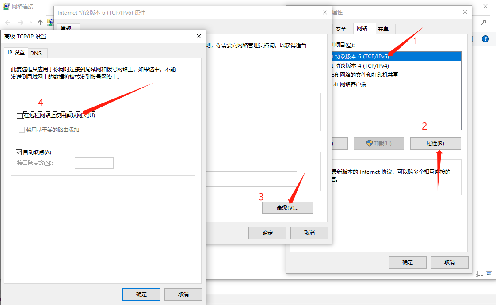

# 网络接口监听器

一个小工具，帮助你在指定的网络接口连接时，添加静态路由。帮助你在多个网络接口（或者vpn）的情况下，让特定的网络流量走指定的网络接口。

## 配置文件

支持域名、ip、网段的配置，配置文件为json格式，默认配置文件路径为`./config.json`，配置文件内容如下：

注意名称要与vpn名称相同

```json
{
  "interfaces": [
    {
      "name": "ppp0",
      "routes": [
        "github.com",
        "192.168.188.11",
        "192.168.188.0/24"
      ]
    }
  ]
}
```

指定配置文件路径 `netcatcher -c /var/config.json`

## 快速开始

**由于需要操作路由，本程序需要管理员权限**

```bash
sudo ./netcatcher
## windows 用户使用管理员权限运行
```

## macos 使用

### 启动 netcatcher

#### 手动启动方式

```bash
sudo ./netcatcher
## windows 用户使用管理员权限运行
```

#### 通过 launchctl 启动

通过脚本快速配置启动服务，通过`launchctl`方式，可以配置开机自启动

```
curl -s https://raw.githubusercontent.com/attson/netcatcher/main/install/darwin.sh | NETCATCHER_VERSION=v0.0.4 NETCATCHER_OS=darwin_amd64 bash
```

### 运行日志

```bash
$ tail -f /usr/local/var/log/com.attson.netcatcher.log
2023/02/05 17:01:32 netcatcher started...
2023/02/05 17:01:32 ppp0: [info] interface status is connected
add host 140.82.113.3: gateway 192.168.199.51
2023/02/05 17:01:32 ppp0: [debug] add route github.com -> 140.82.113.3 @ 192.168.199.51
add host 192.168.188.11: gateway 192.168.199.51
2023/02/05 17:01:32 ppp0: [debug] add route 192.168.188.11 -> 192.168.188.11 @ 192.168.199.51
add net 192.168.188.0: gateway 192.168.199.51
2023/02/05 17:01:32 ppp0: [debug] add route 192.168.188.0/24 -> 192.168.188.0/24 @ 192.168.199.5
```

## windows 使用

### 添加vpn连接



在网络设置中按自己的vpn配置，添加vpn连接

### 禁用全局连接

默认情况下，vpn连接会将所有流量都走vpn，这里我们需要禁用全局连接，才能按需配置路由

1. 找到vpn连接，右键属性，选择网络


2. 禁用全局连接，ipv6和ipv4都需要禁用


此时，所有流量都不会走vpn

### 启动 netcatcher

#### 手动启动方式

```bash
# 用管理员权限运行cmd，注意要在当前文件目录下配置 config.json
./netcatcher.exe
```

#### task scheduler 启动

通过脚本快速配置启动服务，通过`task scheduler`方式，可以配置开机自启动

先编写netcatcher.vbs，放到 C:\Users\Attson\Downloads\netcatcher_0.2.0_windows_386\netcatcher.vbs 通过vbs启动一个隐藏的cmd

```
set forward=WScript.CreateObject("WScript.Shell")
forward.Run "taskkill /f /im netcatcher.exe",0,True
forward.Run "C:\Users\Attson\Downloads\netcatcher_0.2.0_windows_386\netcatcher.exe -c C:\Users\Attson\Downloads\netcatcher_0.2.0_windows_386\config.json -l C:\Users\Attson\Downloads\netcatcher_0.2.0_windows_386\run.log",0

```

然后通过powershell脚本，配置task scheduler（使用管理员权限运行powershell）

配置系统启动时，以及网络连接时，并使用系统权限运行 netcatcher.vbs （也可以手动在计划任务中添加）

```powershell
$taskName = "netcatcher"
$taskPath = "C:\Users\Attson\Downloads\netcatcher_0.2.0_windows_386\netcatcher.vbs"
$action = New-ScheduledTaskAction -Execute "wscript.exe" -Argument $taskPath
$trigger = New-ScheduledTaskTrigger -AtStartup
$settings = New-ScheduledTaskSettingsSet -AllowStartIfOnBatteries -DontStopIfGoingOnBatteries -StartWhenAvailable -RunOnlyIfNetworkAvailable -DontStopOnIdleEnd
Register-ScheduledTask -TaskName $taskName -Action $action -Trigger $trigger -Settings $settings -User "SYSTEM"
```


### 运行日志

```bash
2023/10/13 22:04:00 以太网:
2023/10/13 22:04:00     fdb0:4c12:48f::f27/128
2023/10/13 22:04:00     fdb0:4c12:48f:0:9dbf:ceb2:c663:bac2/64
2023/10/13 22:04:00     fdb0:4c12:48f:0:104d:23ff:d96d:a364/128
2023/10/13 22:04:00     fdb0:4c12:48f:0:40a2:3839:3c82:1a5b/128
2023/10/13 22:04:00     fdb0:4c12:48f:0:4189:bca7:3776:f81b/128
2023/10/13 22:04:00     fdb0:4c12:48f:0:b9d6:f8cd:471:406/128
2023/10/13 22:04:00     fe80::b9a9:2a98:f24b:2ce1/64
2023/10/13 22:04:00     10.89.89.221/24
2023/10/13 22:04:00 xxxx:
2023/10/13 22:04:00     192.168.199.100/32
2023/10/13 22:04:00 Loopback Pseudo-Interface 1:
2023/10/13 22:04:00     ::1/128
2023/10/13 22:04:00     127.0.0.1/8
2023/10/13 22:14:18 config file: C:\Users\Attson\Downloads\netcatcher_0.2.0_windows_386\config.json
2023/10/13 22:04:00 netcatcher started...
2023/10/13 22:04:00 xxxx: [info] interface status is connected
 操作完成!
2023/10/13 22:04:00 xxxx: [warn] add route fail github.com -> 20.27.177.113 @ 192.168.199.100 invalid write result
路由添加失败: 对象已存在。

2023/10/13 22:04:00 xxxx: [warn] add route fail 192.168.188.11 -> 192.168.188.11 @ 192.168.199.100 invalid write result
路由添加失败: 对象已存在。

2023/10/13 22:04:00 xxxx: [warn] add route fail 192.168.188.0/24 -> 192.168.188.0/24 @ 192.168.199.100 invalid write result
2023/10/13 22:04:10 xxxx: [info] interface status is disconnected
```

## tested on

- [x] macos
- [x] windows

## 参考

- [配置开机启动](https://www.arloor.com/posts/other/start-onboot-windows-macos/)
- [windows route 管理](https://www.163.com/dy/article/FATGQ880053194Z5.html) 
- [如何解决windows vpn全局路由问题](https://superuser.com/a/198396)