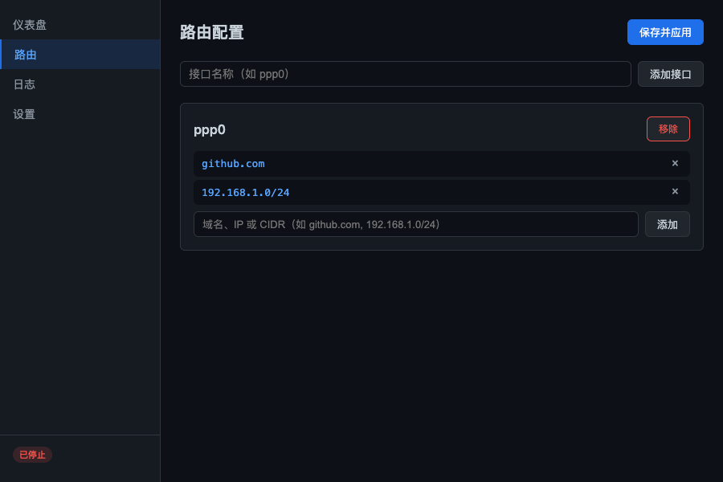

# NetCatcher

[English](README.md)

NetCatcher 是一个桌面应用，用于监控网络接口并在连接时自动添加静态路由。适用于多网卡或多 VPN 场景下，需要将特定流量路由到指定接口的情况。

## 功能

- 仪表盘展示活跃接口及路由状态
- 路由配置编辑器 — 通过 GUI 管理接口和路由规则
- 实时日志查看器 — 实时查看路由添加/删除事件
- 路由连通性测试（Ping）
- 接口连接/断开时系统通知
- 多语言支持（中文 / English）
- 设置面板（开机自启、通知、语言切换）
- 系统托盘 — 关闭窗口时隐藏到托盘，通过托盘菜单退出

## 环境要求

- Go 1.25+
- Node.js 20+
- Wails v3 CLI

```bash
go install github.com/wailsapp/wails/v3/cmd/wails3@latest
```

## 从源码构建

```bash
# 克隆仓库
git clone https://github.com/attson/netcatcher.git
cd netcatcher

# 构建前端
cd frontend && npm ci && npx vite build && cd ..

# 构建 Go 二进制
go build -o build/bin/netcatcher-app .

# 或使用 Wails CLI（自动处理前端和后端）
wails3 build
```

## 运行

应用需要管理员/root 权限来修改路由表。

```bash
sudo ./build/bin/netcatcher-app
```

Windows 下以管理员身份运行可执行文件。

## 使用说明

### 仪表盘

主界面展示所有已配置接口的概览。每个接口卡片显示名称、连接状态、网关 IP 和路由数量。点击卡片可展开查看具体路由，并可通过 **Ping** 按钮测试连通性。使用 **启动** / **停止** 按钮控制监控。


### 路由配置

配置哪些流量通过哪个网络接口：

1. 输入网络接口名称（如 `ppp0`、`utun3`），点击 **添加接口**。
2. 在接口下方输入路由目标 — 域名（`github.com`）、IP 地址（`192.168.1.1`）或 CIDR 地址段（`10.0.0.0/8`） — 点击 **添加**。
3. 按需添加多条路由，然后点击 **保存并应用**。配置立即生效，无需重启。



### 日志

实时日志查看器，显示接口上线/下线、路由添加/删除、错误等事件。可按日志级别筛选或关键词搜索。向上滚动会暂停自动滚动，滚动到底部恢复。


### 设置

- **开机启动** — 注册/取消注册开机自启。
- **通知** — 开启/关闭接口连接和断开时的系统通知。
- **语言** — 在中文和 English 之间切换。偏好设置会保存，重启后保持。


### 系统托盘

应用运行在系统托盘中。关闭窗口会隐藏到托盘 — 应用继续在后台运行并监控。右键点击托盘图标可显示窗口或退出。

## 配置

配置文件存储在平台标准路径下，可通过 GUI 管理：

- macOS: `~/Library/Application Support/NetCatcher/config.json`
- Windows: `%APPDATA%\NetCatcher\config.json`

配置格式为 JSON。支持域名（连接时通过 DNS 解析）、IP 地址和 CIDR 地址段：

```json
{
  "interfaces": [
    {
      "name": "ppp0",
      "routes": [
        "github.com",
        "192.168.188.11",
        "192.168.188.0/24"
      ]
    }
  ]
}
```

`name` 字段必须与操作系统中的网络接口名称完全一致（如 VPN 适配器名称）。

## 平台说明

### macOS

应用需要 root 权限来调用 `route` 命令。使用 `sudo` 启动，或为生产构建授予相应权限。

### Windows

默认情况下，VPN 连接会将所有流量路由到隧道。要使用按路由配置：

1. 打开 VPN 适配器属性（网络设置 -> VPN 连接 -> 右键 -> 属性 -> 网络）。
2. 选择 Internet 协议版本 4 (TCP/IPv4) -> 属性 -> 高级。
3. 取消勾选"在远程网络上使用默认网关"。如有需要，对 IPv6 重复此操作。

这将阻止所有流量通过 VPN 发送，让 NetCatcher 的静态路由控制哪些目标使用隧道。

## 注意事项

- 如果本地 DNS 代理或全局代理处于活动状态，域名可能解析到错误的 IP 地址。如果依赖基于域名的路由，请在启动 NetCatcher 前禁用代理。
- 路由在每次接口连接时重新解析，因此接口重连时会自动获取 DNS 变更。
