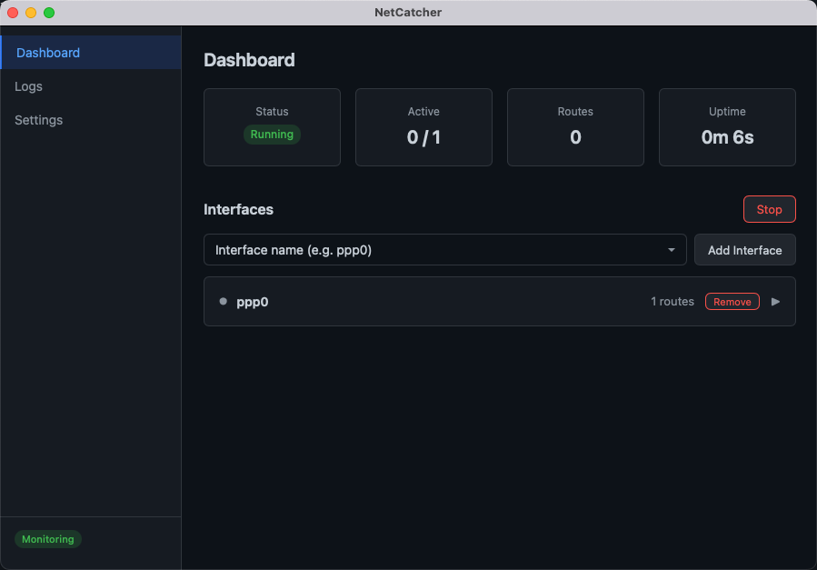
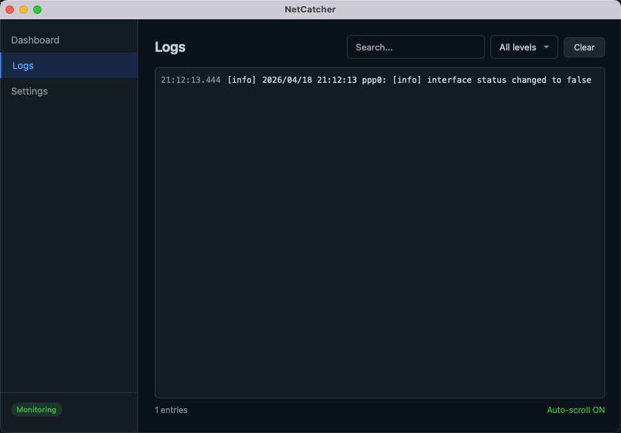
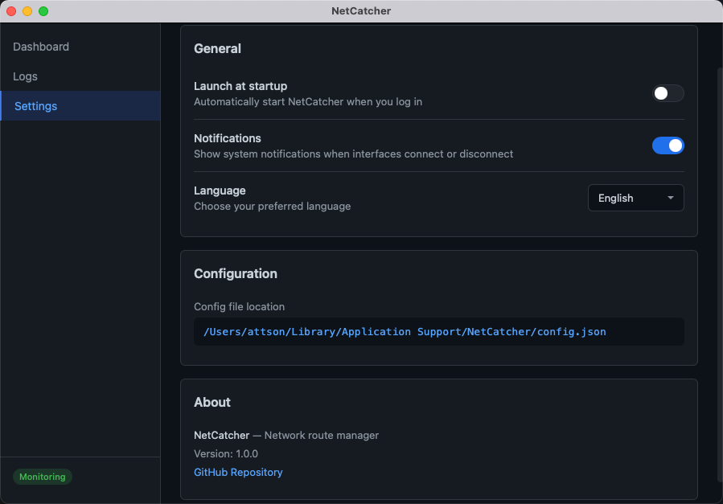
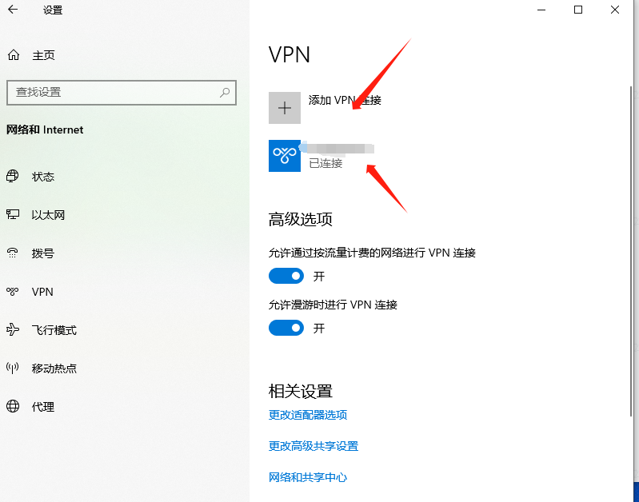
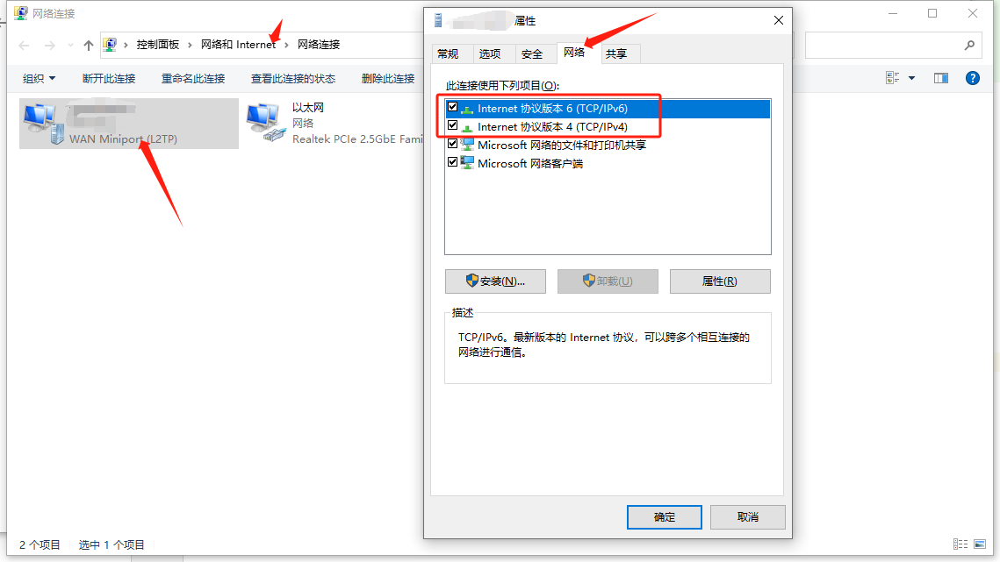

# NetCatcher

[English](README.md)

NetCatcher 是一个桌面应用，用于监控网络接口并在连接时自动添加静态路由。适用于多网卡或多 VPN 场景下，需要将特定流量路由到指定接口的情况。

## 功能

- 仪表盘展示活跃接口及路由状态
- 路由配置编辑器 — 通过 GUI 管理接口和路由规则
- 实时日志查看器 — 实时查看路由添加/删除事件
- 路由连通性测试（Ping）
- 接口连接/断开时系统通知
- 多语言支持（中文 / English）
- 设置面板（开机自启、通知、语言切换）
- 系统托盘 — 关闭窗口时隐藏到托盘，通过托盘菜单退出

## 安装

从 [Releases](https://github.com/attson/netcatcher/releases) 页面下载最新版本：

| 平台 | 文件 |
|------|------|
| macOS (Apple Silicon) | `NetCatcher-arm64.dmg` |
| macOS (Intel) | `NetCatcher-amd64.dmg` |
| Windows | `NetCatcher-amd64.exe` |

**macOS：** 打开 `.dmg` 文件，将 NetCatcher 拖入"应用程序"文件夹。首次添加路由时会弹出密码输入框请求授权，之后无需重复输入。

**Windows：** 以管理员身份运行 `NetCatcher-amd64.exe`。

## 从源码构建

### 环境要求

- Go 1.25+
- Node.js 20+

```bash
# 克隆仓库
git clone https://github.com/attson/netcatcher.git
cd netcatcher

# 构建前端
cd frontend && npm ci && npx vite build && cd ..

# 构建 Go 二进制
go build -o build/bin/netcatcher-app .

# 运行
./build/bin/netcatcher-app
```

## 使用说明

### 仪表盘

主界面集成了状态监控和路由配置。系统网络接口以下拉列表展示，VPN 接口会显示服务名称（如 `ppp0 (我的VPN)`）方便识别。

- 从下拉列表选择接口，点击 **添加接口**
- 展开接口卡片，添加路由规则 — 域名、IP 或 CIDR 地址段
- 点击 **保存并应用**（仅在有修改时显示）
- 使用 **Ping** 测试路由连通性
- 使用 **启动** / **停止** 控制监控
- 域名路由会显示解析后的 IP 地址



### 日志

实时日志查看器，显示接口上线/下线、路由添加/删除、错误等事件。可按日志级别筛选或关键词搜索。向上滚动会暂停自动滚动，滚动到底部恢复。



### 设置

- **开机启动** — 注册/取消注册开机自启。
- **通知** — 开启/关闭接口连接和断开时的系统通知。
- **语言** — 在中文和 English 之间切换。偏好设置会保存，重启后保持。



### 系统托盘

应用运行在系统托盘中。关闭窗口会隐藏到托盘 — 应用继续在后台运行并监控。右键点击托盘图标可显示窗口或退出。

## 配置

配置文件存储在平台标准路径下，可通过 GUI 管理：

- macOS: `~/Library/Application Support/NetCatcher/config.json`
- Windows: `%APPDATA%\NetCatcher\config.json`

配置格式为 JSON。支持域名（连接时通过 DNS 解析）、IP 地址和 CIDR 地址段：

```json
{
  "interfaces": [
    {
      "name": "ppp0",
      "routes": [
        "github.com",
        "192.168.188.11",
        "192.168.188.0/24"
      ]
    }
  ]
}
```

`name` 字段必须与操作系统中的网络接口名称完全一致（如 VPN 适配器名称）。

## 平台说明

### macOS

首次添加路由时弹出密码输入框请求授权。授权后会创建 sudoers 规则，后续操作无需再次输入密码。退出 app 时路由会自动清理。

### Windows

默认情况下，VPN 连接会将所有流量路由到隧道。要使用按路由配置：

1. 打开 VPN 适配器属性（网络设置 -> VPN 连接 -> 右键 -> 属性 -> 网络）。
2. 选择 Internet 协议版本 4 (TCP/IPv4) -> 属性 -> 高级。
3. 取消勾选"在远程网络上使用默认网关"。如有需要，对 IPv6 重复此操作。

这将阻止所有流量通过 VPN 发送，让 NetCatcher 的静态路由控制哪些目标使用隧道。





## 注意事项

- 如果本地 DNS 代理或全局代理处于活动状态，域名可能解析到错误的 IP 地址。如果依赖基于域名的路由，请在启动 NetCatcher 前禁用代理。
- 路由在每次接口连接时重新解析，因此接口重连时会自动获取 DNS 变更。
